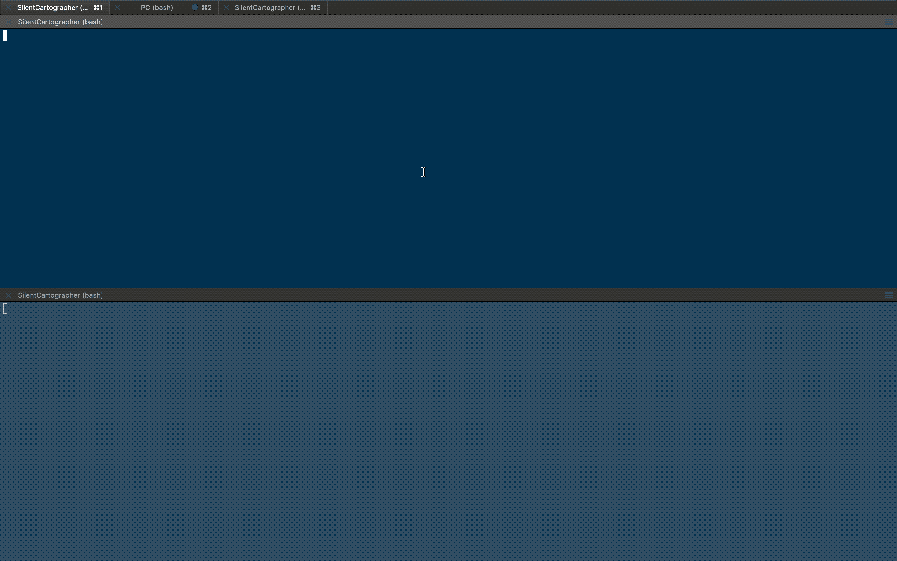

# Silent Cartographer

[](https://github.com/Innmind/SilentCartographer/actions?query=workflow%3ACI)
[](https://codecov.io/gh/Innmind/SilentCartographer)
[](https://shepherd.dev/github/Innmind/SilentCartographer)

Simple tool to visualize all the operations done on the operating system inside other php applications.



## Installation

For the command line tool:
```sh
composer global require innmind/silent-cartographer
```

In the project you want to see operations:
```sh
composer require innmind/silent-cartographer
```

## Usage

To watch all activities:
```sh
silent-cartographer panel
```

In your project in order to send activities:
```php
use Innmind\CLI\{
    Main,
    Environment,
};
use Innmind\OperatingSystem\OperatingSystem;
use Innmind\Url\Path;
use function Innmind\SilentCartographer\bootstrap;

new class extends Main {
    protected function main(Environment $env, OperatingSystem $os): void
    {
        $os = bootstrap($os)['cli'](new Path(__DIR__));
        // then use the $os variable like you would normally do
    }
}
```

In an HTTP server context use the `http_server` context (instead of `cli`), the difference is that if no panel is activated at the reception of a request it will never try to send any activity to the panel for the rest of the request handling (this is done to reduce performance impact).
